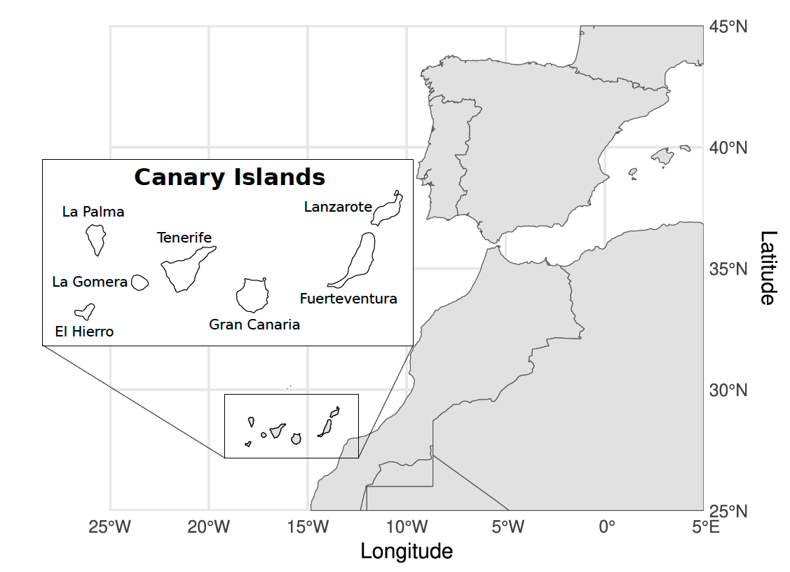
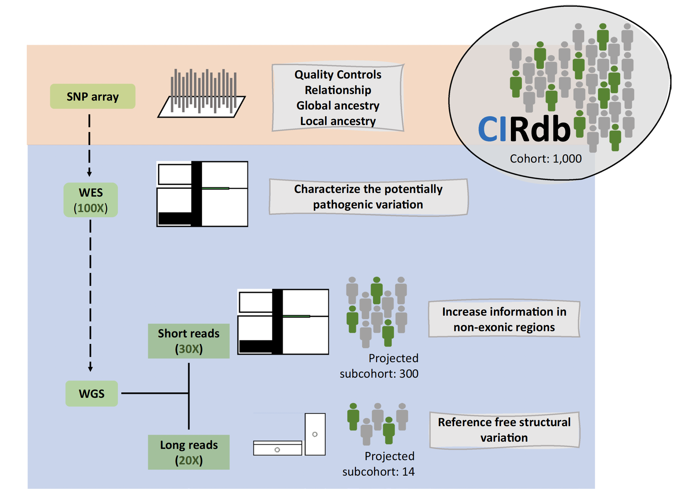
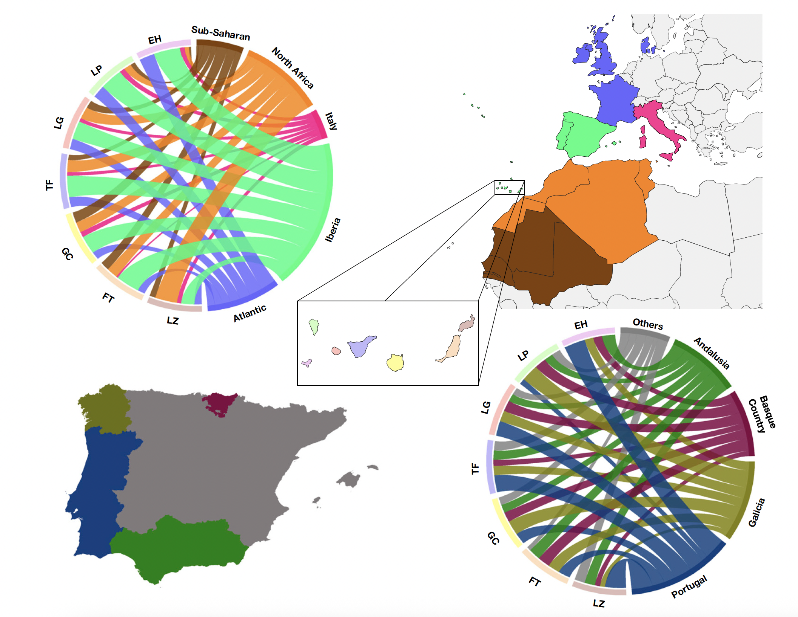
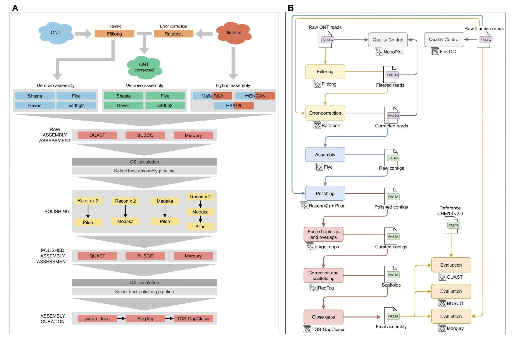

<!-- Last updated: January 24, 2024 -->

# The reference genetic catalog of the Canary Islands (CIRdb)

<!-- --------------------------------- SECTION -------------------------------- -->

## Background

The Canary Islands (Spain) are located ~100 km from the nearest point to the northwest African coast, with a population at the southwestern edge of Europe (Fig. 1). Before their conquest by Europeans in the 15th century, the archipelago was inhabited by aborigines for which diverse evidence supports an ancestral origin in the Berber population from North Africa. After the conquest and their incorporation to the Kingdom of Castile, the population of the Canary Islands was subject to important events of admixture and displacement of aboriginals by European populations and the slavery. The current Canary Islanders are nowadays a genetically admixed population for whom three main ancestries have been recognized: European (EUR), North African (NAF), and sub-Saharan African (SSA). Genetic isolation, the effects of sexual asymmetry evidenced by the historically progressive decrease in male indigenous lineages, and local adaptation events that may took place, have finally modeled a particular Canary Islander genetic makeup with an average of 75-83% of EUR ancestry, 17-23% NAF component, and 2% or less of SSA ancestry (<a href="#1">1</a>).

  

<b>Figure 1</b>. Geographical location of the Canary Islands.

Many studies have established the grounds to increase the diversity in catalogs of genetic variation to optimally represent population-specific particularities and to support Personalized Medicine strategies across populations worldwide. For that, different countries have developed their own genetic variation catalogs or have conducted extensive genetic studies in control individuals for building local population reference catalogs of genetic diversity. In Spain, a pioneer study of Galicians and Andalusians highlighted the need to establish local population catalogs specifically in this country (<a href="#2">2</a>). Based on this and the particular genetic makeup of the current Canary Islands populations (<a href="#1">1</a>), we are developing CIRdb as a detailed sequence-based reference catalog of genetic variation to allow disentangling population specificities with biomedical impact.

## Table of contents

<ul>
  <li><a href="#chapter1">Chapter 1. Developing a reference genetic catalog of the Canary Islands population (CIRdb) (September 2022)</a></li>
  <li><a href="#chapter2">Chapter 2. Mitogenome-based analysis of admixture in CIRdb (December 2022)</a></li>
  <li><a href="#chapter3">Chapter 3. <i>De novo</i> genome assembly of human sequence data leveraging short and long reads to reveal novel genomic features in CIRdb (July 2025)</a></li>
<!--
  <li><a href="#chapter4">Chapter 4. Expanding CIRdb with whole-exome sequencing data (December 2025)</a></li>
-->
  <!--
  <li><a href="#chapter5">Chapter 5. Y chromosome analysis of admixture in CIRdb (xyz 2026)</a></li>
  <li><a href="#chapter6">Chapter 6. Whole-genome sequence analysis in CIRdb (xyz 2026)</a></li>
  -->
  <li><a href="#references">References</a></li>
 </ul>
 

  

 
 

<!-- --------------------------------- SECTION -------------------------------- -->

# Chapter 1. Developing a reference genetic catalog of the Canary Islands population (CIRdb) (September 2022)
The CIRdb cohort was obtained from a total of 1,024 samples that were selected from donors (483 males, 541 females) from a general population cohort of the Canary Islands. Participating individuals self-reported having at least two generations of ancestors born on the same island and a lack of a personal history of cardiovascular, metabolic, immunologic, or cancer diseases at the time of recruitment. The island assigned to each individual corresponded to the island of origin of the four grandparents (<a href="#3">3</a>).

The first genetic study of CIRdb relied on SNP array data as a first stage to efficiently characterize the global and local ancestry components of the cohort individuals, local substructure and inbreeding patterns. It also detected individuals that had cryptic family relationships with others in the cohort, allowing us to prioritize the samples for ulterior approaches. Finally, the study set the grounds for the overall design and methods to build the catalog, including combining whole-exome and whole-genome sequencing strategies to efficiently examine variation affecting gene coding regions while complimentary approaches in subsets of individuals were projected to cover non-exonic regions and to assess structural variation and alike, which are particularly beneficial to assess medically-relevant genes (Fig. 2).

  

<b>Figure 2</b>. Overall schematic representation of the technologies and sample estimates projected for developing CIRdb.

  

 
 

<!-- --------------------------------- SECTION -------------------------------- -->

# Chapter 2. Mitogenome-based analysis of admixture in CIRdb (December 2022)
Pioneer genetic studies of mitochondrial DNA (mtDNA) in the late nineties evidenced specific NAF haplogroups testifying the aboriginal footprints and an important aboriginal maternal component persisting in the current inhabitants of the Canary Islands. Most of these analyses were based, at best, on mtDNA sequences of the 403 pb hypervariable region 1 along with a few coding sites in as much as a thousand unrelated donors in total of previous studies considered together. These low-resolution analyses introduce uncertainty and ascertainment bias, hindering the comparisons.

Given that mitogenomes at full resolution and high quality can be effectively reconstructed from whole-exome and whole-genome sequences (<a href="#4">4</a>), we leveraged the sequence data being generated as part of CIRdb to conduct fine-grained analysis of admixture to precisely apportion the matrilineal genetic components to a level that was never achieved before (<a href="#5">5</a>). We notably increased the estimate of founder lineages surviving in the maternal gene pool of Canary Islanders, evidencing the continuity of a sizable proportion (nearly 50%) of the aboriginal maternal lineages in the current-day population. About half of the mtDNA lineages with sequence similarities with Iberian populations were ascribed to Galicians and Portuguese influences (Fig. 3). The results also supported the genetic connections between current Canary Islanders and the American continent.

  

<b>Figure 3</b>. Maternal genetic contributions of continental populations based on the mtDNA sequence matching between the Canary Islands and African and European populations (EH: El Hierro; LP: La Palma; LG: La Gomera; TF: Tenerife; GC: Gran Canaria; FT: Fuerteventura; LZ: Lanzarote).

  

 
 

<!-- --------------------------------- SECTION -------------------------------- -->

# Chapter 3. <i>De novo</i> genome assembly of human sequence data leveraging short and long reads to reveal novel genomic features in CIRdb (July 2025)

Accurate reconstruction of individual human genomes is key as the Precision Medicine paradigm shift is embraced. However, de novo assemblies of large and complex genomes remain challenging. To deploy robust bioinformatics tools for de novo genome assembly to provide a comprehensive and unbiased understanding of a patient’s DNA sequence, we have tested the performance of hybrid assemblies leveraging short- and long-read technologies on reference and CIRdb materials (<a href="#6">6</a>). This allowed us to identify the best performing tools for the different stages involved (Fig. 4) and to set up and deploy our internal pipeline for implementing de novo assembly (https://github.com/genomicsITER/hybridassembly) to be able to reveal novel structural genomic features in biomedical studies in the future.

  

<b>Figure 4</b>. Schematic diagram of A) the benchmarking study conducted and B) the de novo genome assembly pipeline developed for the on-going studies.

  

 
 

<!-- --------------------------------- SECTION -------------------------------- -->
<!-- 

# Chapter 4. Expanding CIRdb with whole-exome sequencing data (December 2025)
One central aim of the project has been to catalog the variation affecting exonic regions given the important biomedical implications of coding regions of the genome. To improve the population-specific reference catalog, we used whole-exome sequencing of the full CIRdb cohort to identify 387,555 single nucleotide variants and small indels (Fig. 5). For the study (<a href="#7">7</a>), we complemented the analyses with paired SNP array data and additional sequencing data for regions of interest. 

  

<b>Figure 5</b>. Distribution of whole-exome sequencing variants found in CIRdb based on genomic region and impact classification provided by Ensembl VEP.

A total of 15.1% of the whole-exome variants were categorized as novel at the time the analyses were conducted, emphasizing the key necessity for developing a population-specific catalog of genetic diversity in this archipelago. Based on distinct variant annotations, we identify genetic variation that could have significant biomedical implications for prevalent diseases, including metabolic, infectious, and respiratory diseases, among others, and in skin pigmentation and sunburn. As we have previously shown (1), we also confirm that the populations from El Hierro and La Gomera behave as outliers in terms of genetic diversity and isolation.

The study also revealed genomic regions showing large deviations in the local genetic ancestry, including one in 17q21.31 not identified in previous studies (1), and overlapping with an inversion site under positive selection in Europeans and showing pleiotropic effects across diseases. We also identified shared patterns of genetic differentiation between North Africans and Canary Islanders that were distinct from Europeans. This allowed to prioritize a region around PRUNE1, a genomic region associated with body mass index, and metabolic and cardiovascular disorders, to be under putative positive selection in the population.

We expect this CIRdb resource to constitute a key resource to assist in the identification of genetic risks and in enabling laying the foundation for Genomic Medicine programs in the region.

  

 -->

 
 

<!-- --------------------------------- SECTION -------------------------------- -->

<!-- 

# Chapter 5. Y chromosome analysis of admixture in CIRdb (xyz 2026)

Studies are ongoing. Results to be announced.

NOTE: add the benckmarking of Y haplogroup classifiers.

  

 
 
-->

<!-- --------------------------------- SECTION -------------------------------- -->

<!-- 
# Chapter 6. Whole-genome sequence analysis in CIRdb (xyz 2026)

Studies are ongoing. Results to be announced.

  

 
 
-->

<!-- --------------------------------- SECTION -------------------------------- -->

## References
<a name="1">1</a>: Guillen-Guio B, Lorenzo-Salazar JM, González-Montelongo R, Díaz-de Usera A, Marcelino-Rodríguez I, Corrales A, Cabrera de León A, Alonso S, Flores C. Genomic Analyses of Human European Diversity at the Southwestern Edge: Isolation, African Influence and Disease Associations in the Canary Islands. Mol Biol Evol. 2018 Dec 1;35(12):3010-3026. doi: https://doi.org/10.1093/molbev/msy190

<a name="2">2</a>: Dopazo J, Amadoz A, Bleda M, Garcia-Alonso L, Alemán A, García-García F, Rodriguez JA, Daub JT, Muntané G, Rueda A, Vela-Boza A, López-Domingo FJ, Florido JP, Arce P, Ruiz-Ferrer M, Méndez-Vidal C, Arnold TE, Spleiss O, Alvarez-Tejado M, Navarro A, Bhattacharya SS, Borrego S, Santoyo-López J, Antiñolo G. 267 Spanish Exomes Reveal Population-Specific Differences in Disease-Related Genetic Variation. Mol Biol Evol. 2016 May;33(5):1205-18. doi: https://doi.org/10.1093/molbev/msw005

<a name="3">3</a>: Díaz-de Usera A, Rubio-Rodríguez LA, Muñoz-Barrera A, Lorenzo-Salazar JM, Guillen-Guio B, Jáspez D, Corrales A, Íñigo-Campos A, García-Olivares V, Rodríguez Pérez MDC, Marcelino-Rodríguez I, Cabrera de León A, González-Montelongo R, Flores C. Developing CIRdb as a catalog of natural genetic variation in the Canary Islanders. Sci Rep. 2022 Sep 27;12(1):16132. doi: https://doi.org/10.1038/s41598-022-20442-x

<a name="4">4</a>: García-Olivares V, Muñoz-Barrera A, Lorenzo-Salazar JM, Zaragoza-Trello C, Rubio-Rodríguez LA, Díaz-de Usera A, Jáspez D, Iñigo-Campos A, González-Montelongo R, Flores C. A benchmarking of human mitochondrial DNA haplogroup classifiers from whole-genome and whole-exome sequence data. Sci Rep. 2021 Oct 15;11(1):20510. doi: https://doi.org/10.1038/s41598-021-99895-5

<a name="5">5</a>: García-Olivares V, Rubio-Rodríguez LA, Muñoz-Barrera A, Díaz-de Usera A, Jáspez D, Iñigo-Campos A, Rodríguez Pérez MDC, Cabrera de León A, Lorenzo-Salazar JM, González-Montelongo R, Cabrera VM, Flores C. Digging into the admixture strata of current-day Canary Islanders based on mitogenomes. iScience. 2022 Dec 29;26(1):105907. doi: https://doi.org/10.1016/j.isci.2022.105907

<a name="6">6</a>: Muñoz-Barrera A, Rubio-Rodríguez LA, Jáspez D, Corrales A, Marcelino-Rodriguez I, Ortiz L, Mendoza P, Lorenzo-Salazar JM, González-Montelongo R, Flores C. Benchmarking of bioinformatics tools for the hybrid de novo assembly of human and non-human whole-genome sequencing data. Comput Struct Biotechnol J. 2025 Jul 13;27:3099-3109. doi: https://doi.org/10.1016/j.csbj.2025.07.020
 
<!-- <a name="7">7</a>: Diaz-de Usera A, Rubio-Rodriguez LA, Muñoz-Barrera A, Lorenzo-Salazar JM, Guillen-Guio B, Jaspez D, Corrales A, Marcelino-Rodriguez I, Rodriguez-Perez M.C., Cabrera-de Leon A, Gonzalez-Montelongo R, Cruz-Guerrero R, Carracedo A, Carlos Flores. Expanding CIRdb, a comprehensive catalog of whole-exome sequencing data of Canary Islanders. MedRxiv 2025. -->

  

 
 

<!-- --------------------------------- SECTION -------------------------------- -->

## Update logs

<!-- > Chapter 4. Expanding CIRdb with whole-exome sequencing data (December 2025). -->

> November 26, 2025. This repository goes public.

> Chapter 3. De novo genome assembly of human sequence data leveraging short and long reads to reveal novel genomic features in CIRdb (July 2025).

> Chapter 2. Mitogenome-based analysis of admixture in CIRdb (December 2022).

> Chapter 1. Developing a reference genetic catalog of the Canary Islands population (CIRdb) (September 2022).

